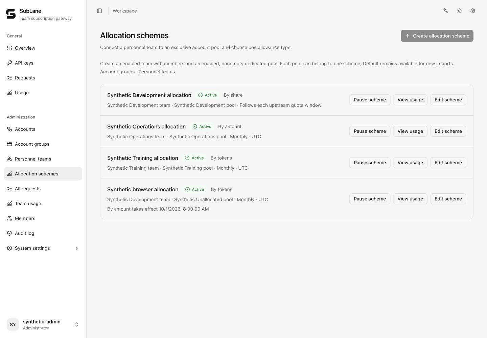
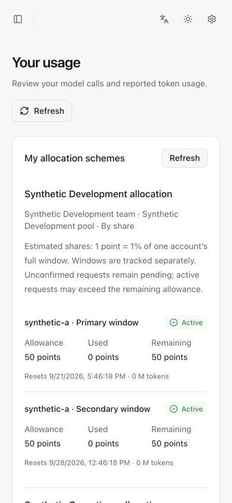

# Team resources and allocation rules

Administrators work with three concepts: a **team** is who shares access, an **account pool** is which subscription accounts serve requests, and a **team resource** connects one team to one dedicated pool with one allowance rule. The database and API retain the name `scheme` for compatibility, but it is an implementation detail. A member can belong to several teams and has independent balances in each team resource.

## Free use by default

For ordinary shared use, select the members and **Account pools for free use** in a personnel team, then save. No allocation scheme, model prices, percentages or token ceiling are required. Members create a personal key for an authorized pool. This default does not grant access to unselected pools or remove existing member limits, model policies or upstream quotas.

**Advanced settings: usage limits** is collapsed by default. Open it only to configure share, amount or token allowances. Existing rules remain effective and their count stays visible while collapsed. Pausing a rule stops access; it does not convert its reserved pool to free use. Reserved pools are excluded from the free-use checklist.

The following workflow is optional and applies only when an allowance is needed.

## Administrator workflow

1. Create members, then open **Personnel teams**. Create a team, add its members, and select any shared account groups the team may use. A member's visible groups are the union of all their enabled teams; a member with no enabled team sees no groups.
2. Create a dedicated account group. New imports remain unassigned until added to a group. Ensure its accounts belong only to this pool before reserving it; all ordinary pools, including the former Default pool, follow the same rules.
3. Edit the team, expand **Advanced settings: usage limits**, and click **Add resource allowance**. Choose the dedicated pool and one of **By share**, **By amount**, or **By tokens**. The team is already fixed by the page, so there is no second team or scheme-name setup step. Only enabled, nonempty, unassigned dedicated pools are offered. The server also rejects shared physical accounts.
4. Set member allowances. A blank member is excluded. Share allocations must total at most 100%; the remainder is unallocated. Amount and token allowances are independent member limits, not an assertion of the subscription's total capacity.
5. Amount mode lets you select pool models from a dropdown; input, cached-input and output prices are filled from the shared catalog and can be edited before saving. Share mode normally needs no model setup: SubLane reads the pool's current Codex model catalog, resolves prices automatically, and stores the resulting model weights in the revision. Expand advanced model weights only for an explicit override. Missing model prices block saving and requests; prices are copied into the revision, so later catalog updates do not change historical usage.
6. In share mode, optionally enable **Allow idle share borrowing**. A member may then use unused share on the same physical account and window; the excess is recorded as borrowed points and sticky conversations stay on their current account.
7. Choose whether the new resource starts immediately or at the next reset (optional; immediate activation is the form default). Members create a new personal Key choosing the team resource and pool. Existing keys are not rebound automatically and unbound keys cannot use a reserved pool.
8. Inspect **View usage** for balances and unresolved requests. Members see only their own scheme allocations on **Usage**.

A scheme permanently reserves the pool's account membership in this version, including while paused. Its team and pool bindings cannot be changed. Reserved accounts cannot be deleted or moved between pools; disable an account to stop routing it. There is no scheme deletion or capacity sharing across schemes. Idle borrowing is opt-in within one account window and one scheme; it never combines physical accounts or reset windows. Plan the dedicated pools before creating schemes.

## Exactly one allowance type

| Type | Member input | Accounting | Reset |
| --- | --- | --- | --- |
| By tokens | M tokens, up to six decimal places | Input + output; cached input is already included in input | UTC day or month |
| By amount | USD, up to six decimal places | Configured input/cache/output prices per M tokens | UTC day or month |
| By share | Percentage, up to two decimal places | Observed percentage-point changes apportioned by model-weighted usage | Each upstream subscription window |

1 M = 1,000,000 tokens. Token counts remain exact integers; USD amounts use integer micro-USD. Amount charges sum all token categories before rounding up to a micro-USD. USD is an internal allowance unit, not billing or an upstream cash balance. Maximum member token/amount values are 1,000,000 M tokens / 1,000,000 USD, and model prices are at most 1,000 USD per M tokens per category.

Scheme keys bypass legacy member token-budget rules, so amount or share mode does not simultaneously enforce a token ceiling. Member RPM/concurrency limits, account capacity, pool model policy and upstream exhaustion still apply. Unmanaged pools retain existing token-budget behavior.

All keys for one member and scheme share a ledger across HTTP, SSE and WebSocket turns. Limits stop new requests after exhaustion; in-flight requests can exceed the remaining allowance. There is no prediction of a generation's final token count.

## Codex share accounting

Share mode is available only for exclusively reserved Codex accounts with fresh persisted quota snapshots. It does not need an estimate of total subscription tokens. Each account and upstream window has a separate balance; percentages of different windows or accounts are not added into a fictitious pool token balance.

For example, A/B/C receive 50%/30%/20%. Between two usable observations the account consumes 12 percentage points. If their completed request weights are 4:1:1 after applying configured model prices, the charges are 8/2/2 points. Largest-remainder rounding conserves the exact observed delta. Input, cached input and output may each carry different weights.

The upstream percentage is observed; its attribution to members is an **estimate**. Configured prices are not a claim about OpenAI's private quota algorithm. Use the accounts exclusively through SubLane. External use mixed with gateway traffic cannot be distinguished reliably and can distort attribution. A positive delta with no attributable requests blocks the scheme until an administrator acknowledges external usage; it is not assigned to an arbitrary member.

A snapshot must be less than two minutes old, reference the same account lifecycle revision, and identify future window resets. Reconciliation waits until all involved requests have known usage and the snapshot read began after their completion. A missing or unchanged percentage never silently settles debt as zero. Share admission allows at most one active request per account and 32 completed but unreconciled requests per account. This is a bounded provisional window, not a claim that those requests consumed zero or a guarantee against a single large request exceeding its share. Completed requests with known tokens normally display as updating while a bounded background worker polls and reconciles, including after the last request. Admission pauses when 32 requests await confirmation or the oldest has waited two minutes. Prolonged delays, unknown tokens, and expired unreconciled windows remain visible for administrator correction. A missing or unchanged snapshot never forgives consumption. Unavailable peers are isolated so another account with a valid snapshot can continue; sticky conversations never move accounts.

Successful Codex responses can refresh an existing quota window using validated headers or rate-limit events. The observation read boundary is the request dispatch time, never the arrival time of a late event. Partial, regressing, obsolete-lifecycle or reset-changing response observations are ignored; polling establishes new windows. Older in-flight polls cannot overwrite a newer response observation. One bounded worker per account retries after completion and joins process shutdown. New traffic and manual refresh can retry after its two-minute deadline.

After choosing share mode, the form shows member percentages and an exact **Split equally** action. Model weighting and activation settings are collapsed; saved revision prices are preserved when editing shares. Member balances identify anonymous subscription numbers and separate windows, estimated used/remaining amounts, normal updating and paused synchronization. No provider identity is exposed.

Starting immediately allocates only the capacity remaining at the first valid observation. New windows independently allocate their remaining capacity using the configuration active at that window's first observation. Short and long windows remain independent.

## Changes, recovery and retention

Editing allowances, model rates or allowance type schedules a replacement configuration at the current scheme's next cycle. Fixed modes use the next UTC day/month boundary. Share mode uses the latest next-reset timestamp across its account windows and requires valid snapshots to schedule the change. Windows already opened keep their original allocations; new windows use the new configuration. Editing an already scheduled replacement replaces that future configuration without changing current counters. Pause/resume acts immediately without quota network access. Removing a member from a team revokes its keys immediately; rejoining does not clear past usage.

Request records are persisted before upstream dispatch. Settlement shares the gateway history/statistics transaction. A failed accounting commit closes admission; process recovery marks interrupted active records pending. Unknown usage and expired unreconciled percentage debt continue to block the affected member after resets. Pausing or scheduling a different mode does not forgive that debt.

Only administrators can settle unresolved entries, with an audited correction. Token/amount corrections supply total input/output/cache tokens for the original request and use its original prices and window. Ratio corrections supply total percentage points for every original upstream window. Identical retries are idempotent. Corrections cannot lower already known input/output counts, and each token category is bounded to one billion tokens per request. Manual percentage corrections advance the observation baseline to avoid charging the same delta again.

On gateway settlement, closed settled records older than 90 days are removed. Ratio entries remain while any referenced window is within retention. Unresolved records and windows with unacknowledged external usage are retained until resolved; current balances are never pruned.

## Implementation and API

`internal/allocations` owns teams, scheme revisions, request entries and percentage-window accounting. `internal/pricing` loads the LiteLLM-compatible catalog using a local cache, optional SHA-256 polling, fallback and override files. `internal/gateway` supplies snapshots, admission and transactional settlement. Migration `022_allocations.sql` is additive; existing keys and token-budget records are preserved.

Administrator endpoints are `/api/teams`, `/api/allocations`, and `/api/allocations/{id}` with `/refresh`, `/settle`, `/reserve`, and `/enabled` actions. Team writes accept `group_ids`; these are the only unmanaged account groups members of that team can see. `/api/me/allocations` derives identity from the session and returns only that member's shares, balances and pending requests. Key choices are returned by `/api/keys/groups`; creating a scheme key passes `scheme_id`.

Automated verification uses synthetic accounts, temporary databases and fake upstreams. No real Codex subscription capacity or price-to-quota relationship has been validated.

## Interface examples

These screenshots use a separate local instance with synthetic teams, accounts and usage; they are not real subscription balances.

