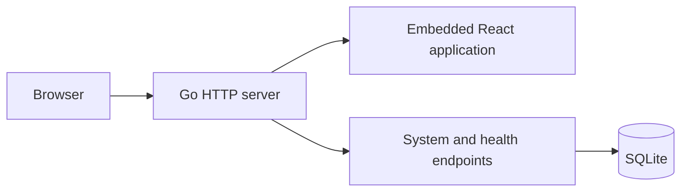

# Architecture

## Current implementation

SubLane is one Go process with chi routing and a client-rendered React frontend. The production build embeds Vite's generated files into the executable. SQLite is the only persistent service dependency; the driver is pure Go, so production builds do not require CGO. Application queries use sqlc-generated Go over `database/sql`; sqlc is a development tool, not a runtime service.

In development, Vite serves the React app and proxies `/api`, `/healthz`, and `/readyz` to the Go backend. In production, the browser and API use the same origin and one port. There is no separate Node.js service, Redis, or PostgreSQL requirement.

## Ownership

| Module | Owns | Does not own |
| --- | --- | --- |
| `cmd/sublane` | Process signals, startup, wiring, shutdown | Domain policy |
| `internal/config` | Validated process environment | Persistent team preferences |
| `internal/auth` | Local users, roles, member lifecycle, and sessions | Member keys or upstream credentials |
| `internal/apikey` | Personal gateway key metadata, hashes, revocation, and lookup | Browser sessions or upstream credentials |
| `internal/storage` | SQLite lifecycle, migrations, and query SQL | Provider authentication |
| `internal/storage/db` | Generated query methods and database row types | Domain policy or public JSON contracts |
| `internal/server` | chi routes, response boundaries, SPA serving | Future routing/account policy |
| `web/src/lib/api.ts` | Response validation and cancellation | Component presentation |
| `web/src/locales` | English and Chinese UI strings | Server diagnostics |

## Persistence

The database runs in WAL mode with foreign keys enabled, a bounded busy timeout, and one open connection. Startup applies ordered embedded SQL migrations and records each migration in the same transaction as its schema change. The settings and administrator/session migrations are followed by `003_members.sql`, which transactionally moves the existing administrator and session metadata into unified `users` and `sessions` tables. The first administrator remains ID 1 and cannot be disabled. No upstream account schema exists yet.

New database files use mode `0600`; newly created data directories use `0700`. Existing directory permissions are not rewritten. Database configuration uses a properly escaped file URL so special characters in the path are supported.

Transactions must stay short. Do not hold them while waiting for upstream network responses. Before introducing concurrent writers or long-running workers, measure contention instead of increasing connection counts blindly.

Named queries live under `internal/storage/queries/`. `sqlc.yaml` reads the same migration history that the application embeds, avoiding a separately maintained schema copy. Domain services retain transaction ownership and use `WithTx` to bind generated methods to the active transaction. Public responses remain domain types, so generated rows cannot accidentally expose password or token hashes. Migration bootstrap and execution remain explicit SQL in storage. Generated Go is versioned and checked with `make generate-check`.

## HTTP and assets

- chi `Route` groups and method-specific registrations own HTTP dispatch; handlers do not switch on request methods or gateway paths. Router-scoped `Use` applies session, role, and bearer checks before 404/405 handling. Public auth uses `Group` and `With` for availability, origin, and login throttling. Domain services remain independent of HTTP.
- Management routes and unknown management paths retain administrator authentication. Public auth and personal key endpoints are explicit exceptions; their unknown paths fall back to administrator protection. JSON 405 responses derive the Allow header from chi's route table. Static assets are registered only for GET/HEAD outside the API routers.
- Liveness does not depend on SQLite; readiness does.
- Management routes under `/api/` require an enabled administrator session by default. Only the four explicit auth endpoints are public; state-changing browser requests enforce exact origin checks. Personal `/api/keys` routes accept either enabled role and derive ownership from the session. `/v1` uses separate bearer-key authentication and returns 501 on known model routes until forwarding is available.
- System and health JSON responses use `Cache-Control: no-store`.
- The SPA document revalidates; hashed `/assets/` files may be cached immutably.
- Unknown API routes return JSON errors (401 before authentication in the protected subtree, otherwise 404), and missing static files return 404. They never become a successful HTML response.
- Headers prevent MIME sniffing and framing, and limit referrer disclosure to the same origin.
- Startup sets a header-read timeout and an idle timeout. Future streaming routes need their own resource and cancellation design.
- SIGINT/SIGTERM stops accepting new work and allows up to ten seconds for HTTP shutdown.

## Frontend

TanStack Router owns navigation and loads page components on demand. TanStack Query owns remote request state. Zod validates the system response; failure is displayed as an error with a retry action rather than fabricated healthy data.

The Shadcn Admin subset provides the sidebar and shared primitives. Application pages are SubLane-specific and contain no demo business records. Theme preferences are managed by `next-themes`; translations use `i18next` and `react-i18next`. English is the default even in a Chinese-language browser. The Chinese dictionary must have exactly the English keys at compile time.

The root auth gate waits for server state before mounting protected pages. Management queries are enabled only for administrators, including during redirect transitions. One frontend access policy controls navigation and direct-route guards. Members get a personal homepage and shared appearance/language settings, without querying system or member-management data. Personal key queries include the owner ID in their cache key and opt into member access only while that identity remains current. Logout cancels outstanding requests, updates auth state, and removes private query data. Sessions use HttpOnly cookies rather than browser-storage tokens. The complete server contract is documented in [authentication.md](authentication.md).

## Planned gateway boundary

CLIProxyAPI SDK is not linked or initialized in this scaffold. The next integration should use a single embedded SDK service behind a narrow adapter. Keep member identities, admission policy, persisted usage, and HTTP management APIs owned by SubLane.

Before connecting real accounts, validate these behaviors with synthetic upstreams and explicit client checks:

1. Public SDK packages work from an external Go module; do not import upstream `internal` packages.
2. There is one credential refresh owner and an encrypted persistence path.
3. Authentication and revocation apply to each HTTP request and each WebSocket model turn.
4. Account continuation ownership survives retries; a request cannot switch accounts when its conversation or files require the original account.
5. Streaming cancellation releases connections, reservations, and concurrency slots.
6. Usage callbacks, queues, caches, and request bodies have bounded resource policies.
7. Codex CLI and desktop compatibility is tested separately; an OpenAI-compatible HTTP endpoint alone does not prove both clients work.

No performance or memory budget is guaranteed by this scaffold. Measure the combined service under realistic concurrency after the SDK is connected.
