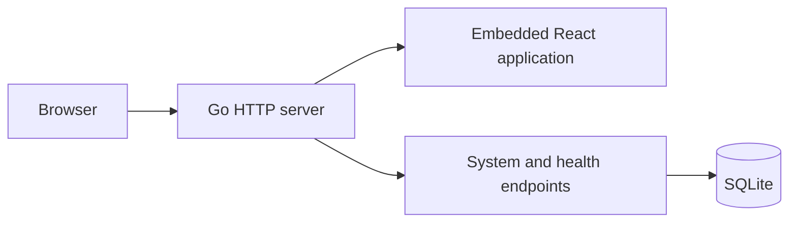

# Architecture

## Current implementation

SubLane is one Go process with a client-rendered React frontend. The production build embeds Vite's generated files into the executable. SQLite is the only persistent service dependency; the driver is pure Go, so production builds do not require CGO.

In development, Vite serves the React app and proxies `/api`, `/healthz`, and `/readyz` to the Go backend. In production, the browser and API use the same origin and one port. There is no separate Node.js service, Redis, or PostgreSQL requirement.

## Ownership

| Module | Owns | Does not own |
| --- | --- | --- |
| `cmd/sublane` | Process signals, startup, wiring, shutdown | Domain policy |
| `internal/config` | Validated process environment | Persistent team preferences |
| `internal/storage` | SQLite lifecycle and migrations | Provider authentication |
| `internal/server` | HTTP routes, response boundaries, SPA serving | Future routing/account policy |
| `web/src/lib/api.ts` | Response validation and cancellation | Component presentation |
| `web/src/locales` | English and Chinese UI strings | Server diagnostics |

## Persistence

The database runs in WAL mode with foreign keys enabled, a bounded busy timeout, and one open connection. Startup applies ordered embedded SQL migrations and records each migration in the same transaction as its schema change. The initial migration creates a settings table; no account, member, or credential schema exists yet.

New database files use mode `0600`; newly created data directories use `0700`. Existing directory permissions are not rewritten. Database configuration uses a properly escaped file URL so special characters in the path are supported.

Transactions must stay short. Do not hold them while waiting for upstream network responses. Before introducing concurrent writers or long-running workers, measure contention instead of increasing connection counts blindly.

## HTTP and assets

- Liveness does not depend on SQLite; readiness does.
- System and health JSON responses use `Cache-Control: no-store`.
- The SPA document revalidates; hashed `/assets/` files may be cached immutably.
- Unknown API namespaces return JSON 404, and missing static files return 404. They never become a successful HTML response.
- Headers prevent MIME sniffing and framing, and limit referrer disclosure to the same origin.
- Startup sets a header-read timeout and an idle timeout. Future streaming routes need their own resource and cancellation design.
- SIGINT/SIGTERM stops accepting new work and allows up to ten seconds for HTTP shutdown.

## Frontend

TanStack Router owns navigation and loads page components on demand. TanStack Query owns remote request state. Zod validates the system response; failure is displayed as an error with a retry action rather than fabricated healthy data.

The Shadcn Admin subset provides the sidebar and shared primitives. Application pages are SubLane-specific and contain no demo business records. Theme preferences are managed by `next-themes`; translations use `i18next` and `react-i18next`. English is the default even in a Chinese-language browser. The Chinese dictionary must have exactly the English keys at compile time.

## Planned gateway boundary

CLIProxyAPI SDK is not linked or initialized in this scaffold. The next integration should use a single embedded SDK service behind a narrow adapter. Keep member identities, admission policy, persisted usage, and HTTP management APIs owned by SubLane.

Before connecting real accounts, validate these behaviors with synthetic upstreams and explicit client checks:

1. Public SDK packages work from an external Go module; do not import upstream `internal` packages.
2. There is one credential refresh owner and an encrypted persistence path.
3. Authentication and revocation apply to each HTTP request and each WebSocket model turn.
4. Account continuation ownership survives retries; a request cannot switch accounts when its conversation or files require the original account.
5. Streaming cancellation releases connections, reservations, and concurrency slots.
6. Usage callbacks, queues, caches, and request bodies have bounded resource policies.
7. Codex CLI and desktop compatibility is tested separately; an OpenAI-compatible HTTP endpoint alone does not prove both clients work.

No performance or memory budget is guaranteed by this scaffold. Measure the combined service under realistic concurrency after the SDK is connected.
