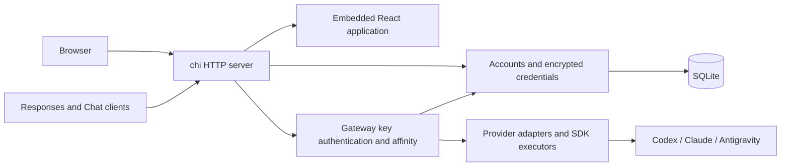

# Architecture

## Current implementation

SubLane is one Go process with chi routing and a client-rendered React frontend. The production build embeds Vite's generated files into the executable. SQLite is the only persistent service dependency; the driver is pure Go, so production builds do not require CGO. Application queries use sqlc-generated Go over `database/sql`; sqlc is a development tool, not a runtime service.

In development, Vite serves the React app and proxies `/api`, `/v1` including WebSocket upgrades, `/healthz`, and `/readyz` to the Go backend. In production, the browser and API use the same origin and one port. There is no separate Node.js service, Redis, or PostgreSQL requirement.

## Ownership

| Module | Owns | Does not own |
| --- | --- | --- |
| `cmd/sublane` | Process signals, startup, wiring, shutdown | Domain policy |
| `internal/config` | Validated process environment | Persistent team preferences |
| `internal/auth` | Local users, roles, member lifecycle, and sessions | Member keys or upstream credentials |
| `internal/apikey` | Personal gateway key metadata, hashes, revocation, and lookup | Browser sessions or upstream credentials |
| `internal/accounts` | Subscription metadata, credential lifecycle, and refresh serialization | HTTP dispatch or client keys |
| `internal/vault` | AES-GCM encryption and private local key loading | OAuth or account policy |
| `internal/oauth` | Session-bound, single-use OAuth attempts | Browser login or model forwarding |
| `internal/upstream` | Public SDK executors, translation, token exchange, and provider protocols | Team roles or database ownership |
| `internal/gateway` | Bounded admission, account affinity, persisted quota snapshots, and per-request orchestration | Public management authorization |
| `internal/storage` | SQLite lifecycle, migrations, and query SQL | Provider authentication |
| `internal/storage/db` | Generated query methods and database row types | Domain policy or public JSON contracts |
| `internal/server` | chi routes, response boundaries, SPA serving | Future routing/account policy |
| `web/src/lib/api.ts` | Response validation and cancellation | Component presentation |
| `web/src/locales` | English and Chinese UI strings | Server diagnostics |

## Persistence

The database runs in WAL mode with foreign keys enabled, a bounded busy timeout, and one open connection. Startup applies ordered embedded SQL migrations and records each migration in the same transaction as its schema change. The settings and administrator/session migrations are followed by `003_members.sql`, which transactionally moves the existing administrator and session metadata into unified `users` and `sessions` tables. The first administrator remains ID 1 and cannot be disabled. `004_api_keys.sql` adds personal keys, and `005_accounts.sql` adds encrypted subscription credentials and bounded account-affinity records. `006_usage.sql` stores the latest normalized quota snapshot per account with cascading deletion. `007_providers.sql` preserves accounts and snapshots while adding provider-scoped identities and affinity; legacy credentials and bindings remain Codex.

New database files use mode `0600`; newly created data directories use `0700`. Existing directory permissions are not rewritten. Database configuration uses a properly escaped file URL so special characters in the path are supported.

Transactions must stay short. Do not hold them while waiting for upstream network responses. Before introducing concurrent writers or long-running workers, measure contention instead of increasing connection counts blindly.

Named queries live under `internal/storage/queries/`. `sqlc.yaml` reads the same migration history that the application embeds, avoiding a separately maintained schema copy. Domain services retain transaction ownership and use `WithTx` to bind generated methods to the active transaction. Public responses remain domain types, so generated rows cannot accidentally expose password or token hashes. Migration bootstrap and execution remain explicit SQL in storage. Generated Go is versioned and checked with `make generate-check`.

## HTTP and assets

- chi `Route` groups and method-specific registrations own HTTP dispatch; handlers do not switch on request methods or gateway paths. Router-scoped `Use` applies session, role, and bearer checks before 404/405 handling. Public auth uses `Group` and `With` for availability, origin, and login throttling. Domain services remain independent of HTTP.
- Management routes and unknown management paths retain administrator authentication. Public auth and personal key endpoints are explicit exceptions; their unknown paths fall back to administrator protection. JSON 405 responses derive the Allow header from chi's route table. Static assets are registered only for GET/HEAD outside the API routers.
- Liveness does not depend on SQLite; readiness does.
- Management routes under `/api/` require an enabled administrator session by default. Only the four explicit auth endpoints are public; state-changing browser requests enforce exact origin checks. Personal `/api/keys` routes accept either enabled role and derive ownership from the session. `/v1` uses separate bearer-key authentication for model discovery, Responses HTTP/SSE/WebSocket, compaction, and Chat Completions translation. WebSocket turns recheck key validity and member enablement.
- System and health JSON responses use `Cache-Control: no-store`.
- The SPA document revalidates; hashed `/assets/` files may be cached immutably.
- Unknown API routes return JSON errors (401 before authentication in the protected subtree, otherwise 404), and missing static files return 404. They never become a successful HTML response.
- Headers prevent MIME sniffing and framing, and limit referrer disclosure to the same origin.
- Startup sets header/body-read and idle timeouts. There is no blanket write timeout for streaming; gateway operations have ten-minute contexts, bounded bodies/events/history, and cancellation propagation.
- SIGINT/SIGTERM stops accepting new work and allows up to ten seconds for HTTP shutdown.

## Frontend

TanStack Router owns navigation and loads page components on demand. TanStack Query owns remote request state. Zod validates the system response; failure is displayed as an error with a retry action rather than fabricated healthy data.

The Shadcn Admin subset provides the sidebar and shared primitives. Application pages are SubLane-specific and contain no demo business records. Theme preferences are managed by `next-themes`; translations use `i18next` and `react-i18next`. English is the default even in a Chinese-language browser. The Chinese dictionary must have exactly the English keys at compile time.

The root auth gate waits for server state before mounting protected pages. Management queries are enabled only for administrators, including during redirect transitions. One frontend access policy controls navigation and direct-route guards. Members get a personal homepage and shared appearance/language settings, without querying system or member-management data. Personal key queries include the owner ID in their cache key and opt into member access only while that identity remains current. Logout cancels outstanding requests, updates auth state, and removes private query data. Sessions use HttpOnly cookies rather than browser-storage tokens. The complete server contract is documented in [authentication.md](authentication.md).

## Provider execution boundary

`internal/upstream` initializes CLIProxyAPI v7.3.7 through its public SDK to obtain the built-in Codex, Claude, and Antigravity executors. No upstream `internal` packages are imported. The SDK manager has an empty, write-rejecting store and receives no live account registrations. A no-op watcher avoids file-based credential synchronization. The SDK lifecycle starts a loopback-only ephemeral HTTP listener: every route is blocked, it has a separate random API key, and management/panel access is disabled. Clients use SubLane’s chi server only. Home mode and Redis are not enabled.

SubLane keeps the durable lifecycle owner. OAuth exchange and refresh use bounded, pinned provider endpoints; rotated credentials are encrypted and saved before model execution. SDK automatic refresh is stopped. Ephemeral model-request auth contains access tokens and allowed provider metadata, never refresh tokens, endpoint overrides, or client-supplied proxy settings. Antigravity uses public `sdk/auth` authorization-code helpers and an explicit executor refresh call within the durable owner. Only that refresh call receives the refresh token; its result is never registered in the SDK manager. The injected transport enforces the caller deadline, response bounds, redirect rejection, and sanitized errors even if the SDK detaches its refresh context. Project preparation also completes within this path. This boundary avoids the SDK manager’s publish-before-persist behavior; do not replace it with unguarded Manager.Register/Update calls.

Model IDs are qualified by channel (`codex/…`, `claude/…`, `antigravity/…`). Unqualified IDs retain Codex compatibility. Model discovery includes healthy configured providers even if another provider fails. Compaction and quota snapshots remain Codex-only. See [provider setup](providers.md) and [gateway details](codex.md).

The vault key is generated as a 0600 file beside SQLite. Startup verifies existing encrypted records and fails closed if the key is missing or mismatched. Backups must preserve the key alongside the database. Refresh and administrator credential changes have one serialized owner; network IO never runs inside a database transaction.

Affinity is scoped to the member, provider, and client session, persists across normal process restarts, and expires after 24 hours of inactivity. Disabled/deleted accounts fail existing conversations instead of triggering unsafe account switching. WebSocket transcript state stays connection-local and bounded. HTTP previous_response_id is rejected because the upstream HTTP backend is stateless; callers must supply full input.

Automated protocol tests use synthetic credentials and fake upstreams. An opt-in test has verified Codex CLI 0.152.1 through HTTP/SSE and WebSocket modes. Real subscription and desktop verification are still separate acceptance steps. No universal memory or throughput budget is claimed; measure the intended workload and deployment platform.
